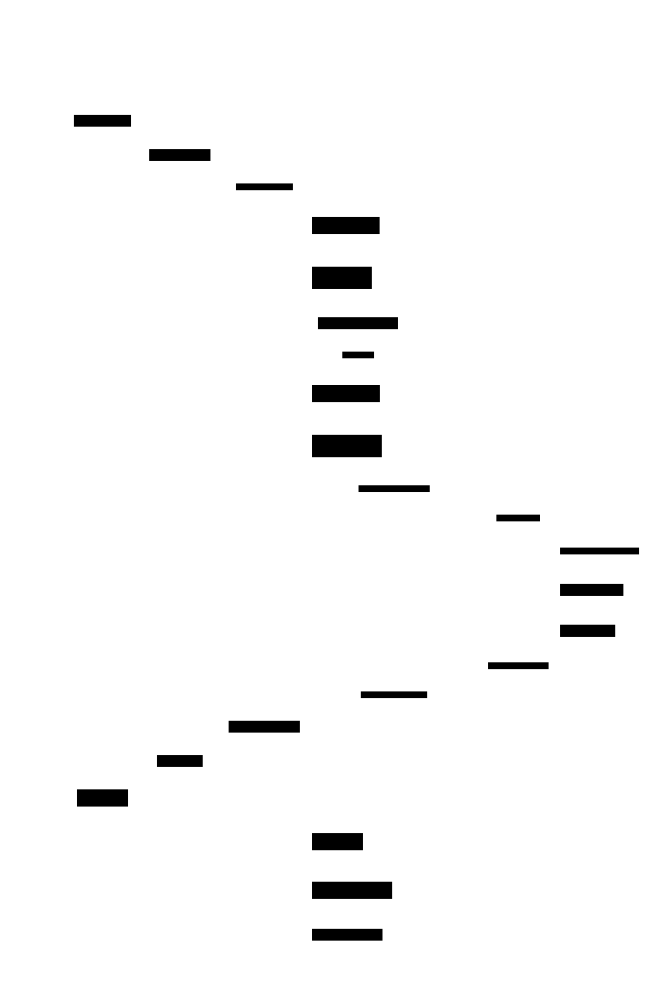

# Bleu — Stellar BRL/PIX Corridor

> Operationalizing **Anchor Platform** + **SDP** + Soroban for Brazil's BRL/PIX corridor on Stellar.
> MIT-licensed. Three Soroban contracts implemented + tested (30 unit tests, CI green), each composing OpenZeppelin's audited `stellar-contracts =0.7.1`; Anchor Platform config, SDK, indexer, and dashboard scaffolds in progress. Pre-mainnet.

[](https://github.com/bleu/stellar-brl-corridor/actions/workflows/ci.yml)
[](LICENSE)

## What this is

An MIT-licensed BR-configured deployment of Stellar's **Anchor Platform** plus **two** mainnet-bound Soroban primitives (audit scheduled via the SDF Soroban Audit Bank, pre-mainnet) and a **testnet proof-of-concept** card-collateral smart account. The corridor wraps SEP-31 B2B receive flows with PIX semantics, surfaces BCB-compliant IOF disclosure inside SEP-38 firm quotes, and turns B2B2B distribution economics into on-chain `partner_transfer` events.

- **Brazil's PIX rail moves ~US$550B/month, and no BACEN-licensed operator runs a production SEP-31 BR anchor today.** Bleu closes that gap with a partner-anchor approach (10-candidate BACEN FX-licensed pool; offshore Stellar anchor as "or equivalent" fallback).
- **The contract logic is portable; the operating corridor is not.** Bleu defends Stellar's LatAm position by making the corridor integration reusable.

Built under [SCF #44](https://communityfund.stellar.org/) (Build Award, Integration track).

## Architecture

See [`docs/architecture/`](docs/architecture/README.md) for the full C4 walkthrough. Quick view:

| Level | Diagram |
| --- | --- |
| L1 — System Context | [](docs/architecture/arch-l1.svg) |
| L2 — Containers | [](docs/architecture/arch-l2.svg) |
| L3 — SEP-31 + SEP-38 + IOF flow | [](docs/architecture/arch-l3-sep31-flow.svg) |
| L3 — CAP-33 sponsor-sandwich onboarding | [](docs/architecture/arch-l3-onboarding.svg) |
| L3 — Card-collateral authorization (testnet PoC) | [](docs/architecture/arch-l3-card-auth.svg) |

## What's in this repo

| Path | Component | Status |
| --- | --- | --- |
| [`contracts/fx-rate-lock/`](contracts/fx-rate-lock) | **SEP-38 Rate-Lock** — locks firm quotes in Temporary storage (CAP-46-12); dies at TTL=0; composes OZ `stellar_fee_abstraction` | Implemented + tested · audit → mainnet |
| [`contracts/partner-attribution/`](contracts/partner-attribution) | **Partner-Attribution Wrapper** — SAC admin wrapper over USDC (OZ `sac_admin_wrapper` + `access_control`); atomic `settle_split`; `partner_transfer` event; `Σ partner.bps ≤ 10_000` invariant | Implemented + tested · audit → mainnet |
| [`contracts/card-collateral-poc/`](contracts/card-collateral-poc) | **Card-Collateral Smart Account** — collateral state machine + OZ `pausable` circuit breaker + `access_control`; USDC-only yield (never XLM) | Implemented + tested · **testnet PoC** |
| [`anchor-platform/`](anchor-platform) | BR-configured Anchor Platform deployment — SEP-10/12/24/31/38, IOF in `fee.details[]`, payout-orchestration glue in the AP business server | T0 stubs → testnet vs sandbox anchor |
| [`sdk/typescript/`](sdk/typescript) · [`sdk/python/`](sdk/python) | Public SDKs (generated from Soroban contract specs via `stellar contract bindings`) | T0 skeleton → T3 published to npm + PyPI |
| [`indexer/`](indexer) | Soroban event indexer — Postgres sink (OSS template) | T0 stub |
| [`apps/dashboard/`](apps/dashboard) · [`apps/partner-console/`](apps/partner-console) | Reference enterprise + partner surfaces | T0 stub |
| [`docs/`](docs) | Architecture, SEP/CAP coverage, grant summary | live |

Payout orchestration is **glue inside the AP business server** (a cursor-batched `Vec<PayoutEntry>` dispatch with fee-bump ×10 retry), **not** a standalone contract.

## Quickstart

Requires **Rust 1.84+** (toolchain pinned in `rust-toolchain.toml`; `wasm32v1-none` target installed automatically), **Node 22+**, and **Docker** (for the local Anchor Platform).

```bash
# Clone
git clone git@github.com:bleu/stellar-brl-corridor.git
cd stellar-brl-corridor

# 1. Build + test all contracts (workspace)
cargo test --workspace
# Wasm build: OZ stellar-contracts 0.7.1 enables soroban-sdk's
# experimental_spec_shaking_v2, so the wasm build needs the build-system flag
# (set automatically by `just build-contracts` and by `stellar contract build`):
SOROBAN_SDK_BUILD_SYSTEM_SUPPORTS_SPEC_SHAKING_V2=1 \
  cargo build --release --target wasm32v1-none --workspace
# or simply:
just build-contracts

# 2. Build the TypeScript SDK (typechecks)
cd sdk/typescript && npm install && npm run build && cd -

# 3. Bring up the Anchor Platform locally against a sandbox anchor
cp anchor-platform/env.example anchor-platform/.env
# edit anchor-platform/.env — see anchor-platform/README.md
docker compose -f anchor-platform/docker-compose.example.yml up
```

The `justfile` wraps the common workflows: `just build`, `just test`, `just wasm`, `just ap-up`, `just lint`.

## Verifying our builds

Every Wasm artifact embeds **build provenance** in the `contractmetav0` custom section so anyone can reproduce and hash-verify what's on-chain:

```bash
# Build with provenance metadata (requires the stellar CLI; install with: cargo install --locked stellar-cli)
stellar contract build \
  --meta commit=$(git rev-parse HEAD) \
  --meta ci_run=$GITHUB_RUN_URL

# Verify a deployed contract's hash matches
stellar contract fetch --network mainnet --id <CONTRACT_ID> | sha256sum
```

CI uploads the release-mode Wasm as an artifact on every build (`contracts-wasm`).

## Deployed addresses

> Live on **testnet** (deployed 2026-05-29; see [`deployments/testnet.json`](deployments/testnet.json), reproduce with `just deploy-testnet`). Mainnet addresses populate after audit (T3). Testnet USDC SAC: [`CBCIMM65…OH37`](https://stellar.expert/explorer/testnet/contract/CBCIMM652YGFPUJ3YVKJL6LNJGHCU7S22IPQXJWMA2ZC7CRA4Q2XOH37).
>
> **Live demo:** all three primitives are demonstrated working on-chain, with reviewer-clickable transaction hashes, in [`docs/DEMO.md`](docs/DEMO.md). Reproduce the full run with `just demo`.
>
> **SDK reads live state:** the TypeScript SDK talks to these deployed contracts. Run `just sdk-example` to connect to testnet RPC and print real on-chain `partner-attribution` state (admin / total_bps / sac) — read-only, no funds. See [`sdk/typescript/examples/read-live-testnet.ts`](sdk/typescript/examples/read-live-testnet.ts).

| Contract | Testnet | Mainnet | Block-explorer |
| --- | --- | --- | --- |
| `fx-rate-lock` | `CDI6XOFI3OSXKDPHRLPGKJGWHP37V2EFX3KUCQ6R2DUMIT2Y7JSJEHIL` | `[post-audit, T3]` | [stellar.expert](https://stellar.expert/explorer/testnet/contract/CDI6XOFI3OSXKDPHRLPGKJGWHP37V2EFX3KUCQ6R2DUMIT2Y7JSJEHIL) |
| `partner-attribution` | `CBQNOWPD4T2PMGADTE6QID6WLMDU7LAHS4LPKOV2USLVXD3X6DX763KR` | `[post-audit, T3]` | [stellar.expert](https://stellar.expert/explorer/testnet/contract/CBQNOWPD4T2PMGADTE6QID6WLMDU7LAHS4LPKOV2USLVXD3X6DX763KR) |
| `card-collateral-poc` | `CDBZXWAN6564WGPWXJRFD6EXEKHYHJV62G23SJJLY5I6ROLC5LQ6H3MW` | **testnet PoC only** | [stellar.expert](https://stellar.expert/explorer/testnet/contract/CDBZXWAN6564WGPWXJRFD6EXEKHYHJV62G23SJJLY5I6ROLC5LQ6H3MW) |

## Roadmap

- **T0 (now)** — Public repo, MIT license, green CI, contract skeletons compiling on testnet.
- **T1** — Anchor Platform on testnet vs sandbox anchor, SEP-31 receive flow end-to-end, FX rate-lock + partner-attribution feature-complete on testnet, card-collateral PoC running, public walkthrough.
- **T2** — Audit submitted via Soroban Audit Bank (SDF-provided credits), BR anchor integration scope signed, BCB/LGPD compliance hooks live, reference dashboard.
- **T3 — Mainnet launch.** Audited contracts live on Stellar Mainnet, E2E corridor flow demonstrable on mainnet, public SDK + reference fintech integration, professional user testing.

Full proposal lives in our team brain (private). Public summary in [`docs/grant.md`](docs/grant.md).

## Standards we consume

SEP-1, SEP-9, SEP-10, SEP-12 (BR custom fields), SEP-24, SEP-31, SEP-38, SEP-41 · CAP-33 (sponsored reserves), CAP-35 (asset clawback inherited from USDC), CAP-46-06 (deterministic USDC SAC), CAP-46-12 (Temporary storage). Full coverage matrix in [`docs/sep-cap-coverage.md`](docs/sep-cap-coverage.md).

All three contracts compose **OpenZeppelin's audited `stellar-contracts =0.7.1`** (`stellar_fee_abstraction`, `stellar_tokens::fungible::sac_admin_wrapper`, `stellar_access::access_control`, `stellar_contract_utils::pausable`) on top of `soroban-sdk`. OZ 0.7.1 requires `soroban-sdk ^25.3.0`, so the workspace pins `soroban-sdk =25.3.0`. Composing audited building blocks shrinks the novel surface that needs Bleu's own audit — it does not make these contracts audited (audit is the T3 deliverable).

## Contributing

See [`CONTRIBUTING.md`](CONTRIBUTING.md). Bug? Open an issue. PRs against `main` are welcome; CI must pass.

## License

[MIT](LICENSE) · © 2026 Bleu LTDA

## Contact

[bleu.builders](https://bleu.builders) · hello@bleu.builders
