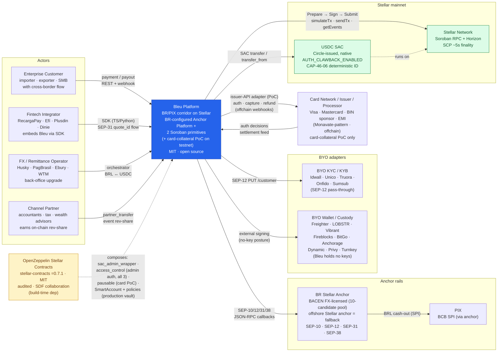
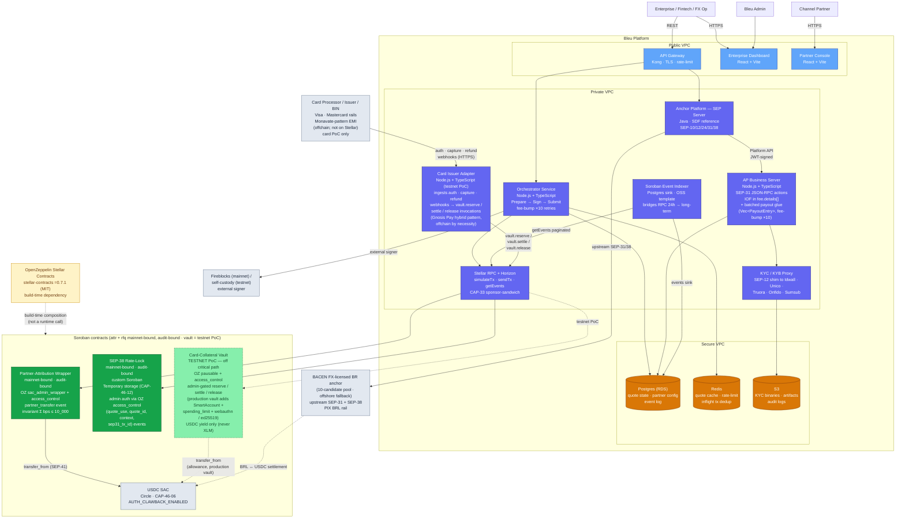
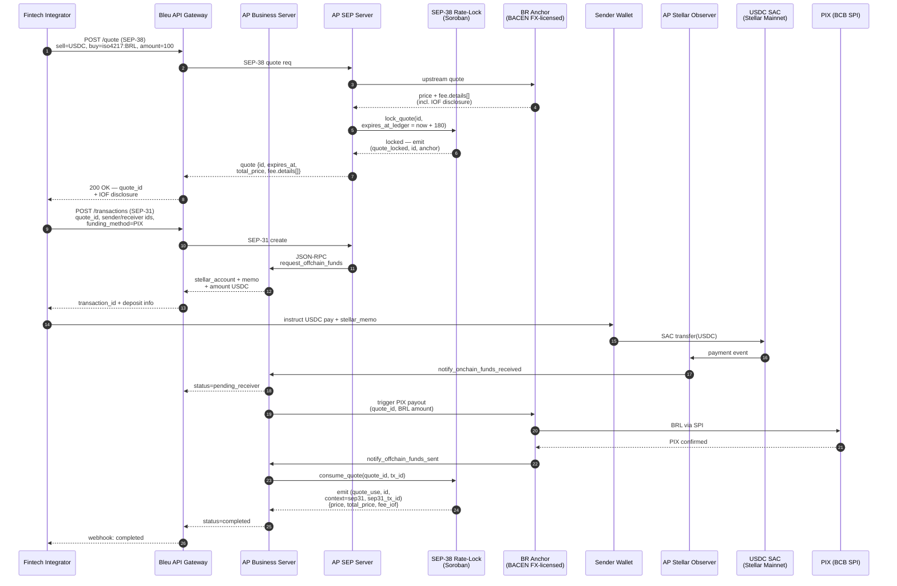
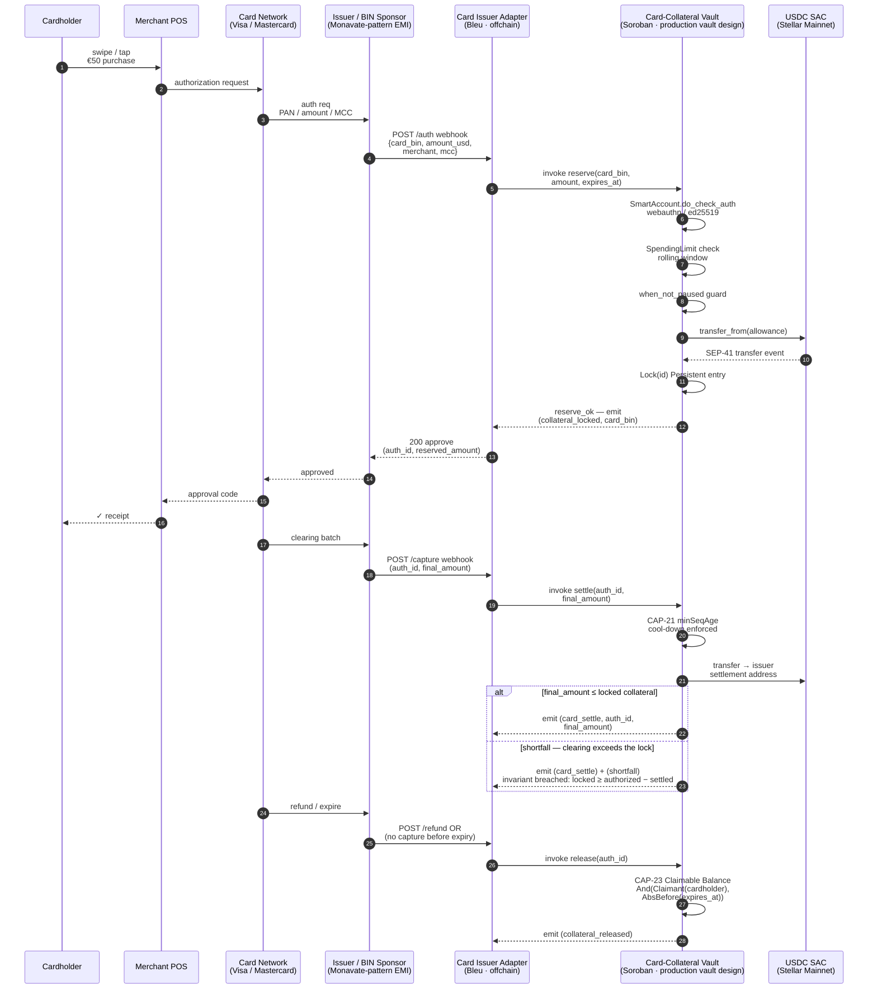
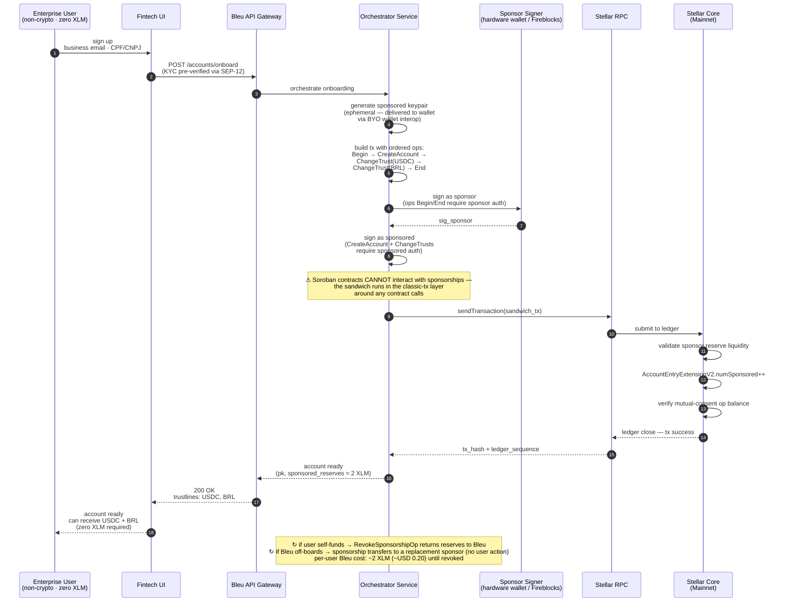

# Bleu — Technical Architecture

Companion to the SCF Build Award (Integration track) proposal. Follows the Stellar KickStart C4 template: L1 System Context → L2 Container → L3 sequences → Contract Overview → Tech Stack → Integrations.

This document is **Stellar-specific** and shows the integration plan against the two SCF Integration-List building blocks Bleu operationalizes: **Anchor Platform** and the **Stellar Disbursement Platform (SDP)**.

> **Scope in one line.** A BR-configured **Anchor Platform** deployment + **two** mainnet-bound Soroban primitives (SEP-38 rate-lock, partner attribution; audit scheduled via the Soroban Audit Bank pre-mainnet), with a **card-collateral smart account shipped as a testnet proof-of-concept** (off the audit/mainnet critical path). Bleu holds no keys; the licensed BR anchor holds the regulated functions.

---

## 1. Introduction

### 1.1 High-Level Overview

Bleu operationalizes two SDF reference implementations — **Anchor Platform** (SEP-10/12/24/31/38) and the **Stellar Disbursement Platform** (SDP, whose one-way bulk-disbursement pattern Bleu makes bidirectional at the API surface) — for Brazil's BRL/PIX corridor, and ships **two** MIT-licensed Soroban primitives (implemented + tested in this repo, audit-bound pre-mainnet) on top:

1. **SEP-38 Rate-Lock** *(mainnet-bound, audit pending)* — firm-quote contract using Temporary storage (CAP-46-12) for quote rows keyed by `DataKey::Quote(BytesN<32>)`; Bleu owns the SEP-38 quote hashing, Temporary-storage lifecycle, and the typed `QuoteExpired` rate-lock deadline. Admin auth composes OpenZeppelin's `stellar_access::access_control` (`#[only_admin]` on `lock_quote` / `consume_quote`), as in the sibling contracts (see [Contract Overview](#3-contract-overview)).
2. **Partner-Attribution Wrapper** *(mainnet-bound, audit pending)* — a SAC admin wrapper on USDC built on OpenZeppelin's `stellar_tokens::fungible::sac_admin_wrapper` over USDC's deterministic SAC, gated by `stellar_access::access_control`. Its `settle_split` moves real balance through the SAC's SEP-41 `transfer`, atomically splitting to partner payouts; it emits a `partner_transfer` event and enforces `Σ partner.bps ≤ 10_000`.

Two further pieces are **not** standalone audited contracts:

- **Payout orchestration is glue, not a contract.** Batched bidirectional dispatch (USDC SAC `transfer` under `require_auth()` over `Vec<PayoutEntry>` keyed by `(batch_id, cursor)`, monotonic `processed_cursor`, fee-bump ×10 retry) lives in the **Anchor Platform business server**, making the SDP one-way bulk model bidirectional for B2B.
- **Card-Collateral Vault is a testnet PoC.** The PoC implements the collateral state machine (`reserve` / `settle` / `release`) and the auth/clearing shortfall accounting, composing OpenZeppelin's `stellar_contract_utils::pausable` (circuit breaker on new collateral) + `stellar_access::access_control` (admin gating). The production vault additionally composes OpenZeppelin's `stellar_accounts::smart_account::SmartAccount` (`do_check_auth`) + `policies::spending_limit` + `verifiers::webauthn` / `ed25519`, with CAP-21 `minSeqAge` cool-downs and CAP-23 claimable-balance auto-return as Bleu-specific glue. Demonstrates a Stellar-only capability — collateral can keep earning **USDC** yield (never XLM) while a policy releases only the spent slice at card auth. Off the audit/mainnet critical path.

Fintechs, FX operators, and channel partners consume the stack via REST API, TypeScript / Python SDK, or a reference dashboard. **Bleu holds no keys.** End-user funds flow through a **BACEN FX-licensed Brazilian anchor** (selected from a 10-candidate pool; an offshore Stellar-compatible anchor is the tested "or equivalent" fallback) that holds the regulated functions (FX, custody, KYC/KYB, COAF, Res 521 reporting).

### 1.2 Constraints

**Security**
- **Non-custodial posture.** Bleu's contracts never hold third-party funds; the anchor holds SPSAV licensing.
- **Static footprint** (CAP-46-05) on every Soroban primitive — predictable fee quoting.
- **Temporary storage for ephemeral state** (CAP-46-12 — dies at TTL=0, unrecoverable): SEP-38 quote rows; per-authorization vault locks (PoC).
- **Persistent storage for long-lived state**: partner configs.

**Regulatory**
- **BCB Resoluções 519–521** (SPSAV regime; FX-reporting regime in force). Bleu = non-custodial software provider; external-counsel-signed preliminary memo at submission.
- **IOF-ready disclosure** via SEP-38 `fee.details[]` (`{name: "IOF", description: "Decreto 6.306/2007"}`, default `0`) — anticipatory; IOF is not currently mandated for crypto/virtual-asset FX. The anchor would collect it at BRL↔USDC conversion if/when it applies.
- **LGPD dual-controller**: anchor controls anchor-collected data, fintech controls SEP-12-injected KYC, Bleu processes operational metadata only.
- **Dual-compliance KYC/KYB**: SEP-12 shares *verified attributes*; does not replace either party's independent obligation.

**Open-source**
- **MIT** on every artifact.
- **Verifiable builds** via `stellar contract build --meta commit=<sha> --meta ci_run=<url>` — embedded in the `contractmetav0` custom Wasm section.

---

## 2. Architecture Overview

### 2.1 Flow — SEP-31 B2B PIX receive with SEP-38 firm quote

1. Fintech calls `POST /quote` (SEP-38) via Bleu API → AP quote endpoint → `id` + `expires_at` + `total_price` + `fee.details[]` (incl. IOF disclosure).
2. Bleu locks the quote on-chain in the rate-lock contract's Temporary storage keyed by `DataKey::Quote(id)` with `expires_at_ledger = now + 180` (~15 min).
3. Fintech calls `POST /transactions` (SEP-31) with `quote_id` + `sender_id` / `receiver_id` (both from prior SEP-12 KYC) + `destination_asset = iso4217:BRL` + `funding_method = "PIX"`.
4. Sender submits a Stellar USDC payment (classic or SAC) with `stellar_memo`.
5. AP's Stellar Observer detects the payment → calls Business Server `notify_onchain_funds_received` → status → `pending_receiver`.
6. Business Server triggers the PIX payout via the anchor API (this is where the batched payout glue runs).
7. Anchor confirms PIX → `notify_offchain_funds_sent` → status → `completed`. `rate_lock.consume_quote(quote_id, sep31_tx_id)` emits `quote_use` with topics `(quote_id, sep31_tx_id)` and data `{price, fee_iof}`.
8. If the quote expires before settlement: Temporary-storage death is the enforcement mechanism.

### 2.2 C4 L1 — System Context

Actors: **Enterprise Customer**, **Fintech Integrator**, **FX / Remittance Operator**, **Channel Partner** (earning rev-share via `partner_transfer` events).

External systems: **BR Stellar Anchor** (BACEN FX-licensed, 10-candidate pool; offshore fallback), **PIX** (via anchor), **BYO KYC/KYB** (Idwall · Unico · Truora · Onfido · Sumsub via SEP-12), **BYO Wallet/Custody**, **Stellar Network**, **USDC SAC**, **Card Network/Issuer** (offchain — relevant only to the card-collateral PoC).

Build-time dependency (composed today): **OpenZeppelin Stellar Contracts** (`stellar-contracts =0.7.1`, MIT, audited by OZ, SDF collaboration), wired into all three contracts. OZ 0.7.1 requires `soroban-sdk ^25.3.0`, so the workspace pins `soroban-sdk =25.3.0`.

### 2.3 C4 L2 — Containers

Three zones inside the Bleu Platform boundary:

- **Public VPC** — API Gateway, Enterprise Dashboard, Partner Console.
- **Private VPC** — Orchestrator (Prepare→Sign→Submit driver), AP SEP Server (SDF reference), AP Business Server (SEP-31 JSON-RPC actions **+ batched payout glue**), KYC/KYB Proxy (SEP-12 shim), Stellar RPC + Horizon clients, Soroban Event Indexer, Card Issuer Adapter (testnet PoC).
- **Secure VPC** — Postgres, Redis, S3.

Outside the boundary: the **two** mainnet Soroban contracts (attribution + rate-lock), the **testnet** card-collateral vault, the USDC SAC, the anchor, and the signer (Fireblocks mainnet / self-custody testnet).

### 2.4 C4 L3 — Key Flow Sequences

#### 2.4.1 SEP-31 + SEP-38 + IOF flow

If the quote expires before settlement, Temporary-storage death (CAP-46-12) is the enforcement mechanism — see [§2.1](#21-flow--sep-31-b2b-pix-receive-with-sep-38-firm-quote).

#### 2.4.2 Card-collateral authorization *(testnet PoC)*

This sequence depicts the **production** card-collateral vault target (SmartAccount / webauthn / spending-limit policy / USDC settlement, CAP-21/23). The shipped testnet PoC ([`contracts/card-collateral-poc`](../../contracts/card-collateral-poc)) implements only the admin-gated reserve/settle/release state machine + shortfall accounting, composing OZ `pausable` + `access_control`; it does not call USDC or `do_check_auth`.

Yield, where present, accrues on **USDC** collateral — never on XLM.

#### 2.4.3 CAP-33 sponsor-sandwich onboarding

The atomic five-operation transaction that creates a zero-XLM-ready account: `BeginSponsoringFutureReservesOp` → `CreateAccountOp` → `ChangeTrustOp(USDC)` → `ChangeTrustOp(BRL)` → `EndSponsoringFutureReservesOp`, with dual signatures for mutual consent. The constraint that governs the whole onboarding path: **Soroban contracts cannot interact with sponsorships**, so the sandwich runs at the classic-tx layer around any contract calls.

---

## 3. Contract Overview

**Two** mainnet-bound Soroban contracts (to run under 2-of-3 admin multisig, upgradeable via `update_current_contract_wasm` where applicable) + **one** testnet PoC + the inherited USDC SAC. Payout orchestration is AP-server glue, not a contract.

The "OZ composition" column lists the audited OpenZeppelin building blocks each contract composes **today** (wired in, not aspirational), plus — for card-collateral — the additional blocks reserved for the production vault. The Bleu-specific column is the novel surface that remains the audit focus. OZ `=0.7.1` requires `soroban-sdk ^25.3.0`; the workspace pins `soroban-sdk =25.3.0`. "Audit-bound" means the audit is the T3 deliverable — these contracts are **not yet audited**.

| Contract | Status | Storage (today) | Emitted events (today) | OZ composition (composed today) | Bleu-specific |
| --- | --- | --- | --- | --- | --- |
| **SEP-38 Rate-Lock** | Implemented + tested · audit-bound | Temporary + Instance | `quote_locked`, `quote_use` | `stellar_access::access_control::AccessControl` (admin auth via `#[only_admin]`) | Quote hashing, Temporary-storage lifecycle, the typed `QuoteExpired` rate-lock deadline, on-chain re-derivation of SEP-38 Price-Formulas invariant |
| **Partner-Attribution Wrapper** | Implemented + tested · audit-bound | Persistent + Instance | `partner_set`, `partner_removed`, `partner_transfer` | `stellar_tokens::fungible::sac_admin_wrapper` + `stellar_access::access_control::AccessControl` | `partner_transfer` event, `Σ bps ≤ 10_000` invariant, atomic `settle_split` over the USDC SAC `transfer` |
| **Card-Collateral Vault** | **Testnet PoC** | Persistent | `collateral_locked`, `card_settle`, `shortfall`, `collateral_released` | `stellar_contract_utils::pausable` + `stellar_access::access_control` (composed today); `stellar_accounts::smart_account::SmartAccount` + `policies::spending_limit` + `verifiers::webauthn` / `ed25519` (production-vault target) | shortfall invariant (`locked ≥ authorized − settled` in the normal path), CAP-21 `minSeqAge` cool-downs, CAP-23 auto-return, **USDC-only** yield (never XLM) |

---

## 4. Technology Stack

- **Soroban Contracts** — Rust, `soroban-sdk =25.3.0` (workspace pin), composing OpenZeppelin's `stellar-contracts =0.7.1` crates (wired into all three contracts today; OZ 0.7.1 requires `soroban-sdk ^25.3.0`). Wasm target: `wasm32v1-none` (Rust ≥1.84). OZ 0.7.1 enables soroban-sdk's `experimental_spec_shaking_v2`, so the wasm build sets `SOROBAN_SDK_BUILD_SYSTEM_SUPPORTS_SPEC_SHAKING_V2=1` (the flag `stellar contract build` sets). Build provenance via `stellar contract build --meta`.
- **AP Business Server & Orchestrator** — Node.js + TypeScript, Fastify; Prepare→Sign→Submit via Stellar RPC; cursor-batched payout dispatch with fee-bump ×10 retries.
- **AP SEP Server** — SDF reference Java implementation, deployed via Docker Compose locally and Helm in production.
- **Frontend** — React + Vite + TypeScript + Tailwind + shadcn/ui. TypeScript bindings generated from Soroban specs via `stellar contract bindings`.
- **Event Indexer** — service polling Stellar RPC `getEvents` with cursor → Postgres. Open-source template.
- **Custody** — self-custody on testnet; Fireblocks for mainnet.

---

## 5. Integrations

1. **Stellar Network (Mainnet)** — primary runtime.
2. **Anchor Platform** — SDF reference, BR-configured. The Integration-List item being operationalized.
3. **Stellar Disbursement Platform** — SDF reference; bulk-disbursement pattern reused as AP-server payout glue (bidirectional B2B).
4. **BACEN FX-licensed BR anchor** — selected from a 10-candidate pool (offshore Stellar anchor as the "or equivalent" fallback).
5. **USDC on Stellar** — Circle-issued native asset via deterministic SAC (CAP-46-06).
6. **OpenZeppelin Stellar Contracts** — `stellar-contracts =0.7.1`, MIT, audited by OZ, SDF collaboration. Composed into all three contracts today (requires `soroban-sdk ^25.3.0`; workspace pins `=25.3.0`).
7. **Soroban event indexer** — Postgres sink (OSS template).
8. **BYO KYC/KYB** — Idwall, Unico, Truora, Onfido, Sumsub via SEP-12 `PUT /customer`.
9. **BYO Wallet / Custody** — Freighter, LOBSTR, Vibrant (retail); Fireblocks, BitGo, Anchorage (institutional); Dynamic, Privy, Turnkey (embedded).
10. **PIX (BCB SPI)** — BRL instant-payment rail, reached via the anchor's banking partner (Bleu does not connect directly).
11. **Card Network / Issuer** — Visa/Mastercard, offchain; relevant only to the card-collateral testnet PoC.

---

## See Also

- [Repo README](../../README.md)
- [SEP & CAP coverage matrix](../sep-cap-coverage.md)
- [Grant summary](../grant.md)
